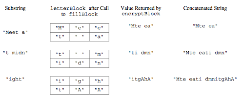

# Route Cipher

In this question you will write two methods for a class RouteCipher that encrypts (puts into a coded form) a message by changing the order of the characters in the message. The route cipher fills a two-dimensional array with single-character substrings of the original message in row-major order, encrypting the message by retrieving the single-character substrings in column-major order.

For example, the word “Surprise” can be encrypted using a 2-row, 4-column array as follows.


An incomplete implementation of the RouteCipher class is shown below.
```java
public class RouteCipher
{
  /** A two-dimensional array of single-character strings,
   instantiated in the constructor */
  private String[][] letterBlock;

  /** The number of rows of letterBlock, set by the constructor */
  private int numRows;

  /** The number of columns of letterBlock, set by the constructor */
  private int numCols;

  /** Places a string into letterBlock in row-major order.
  *   @param str the string to be processed
  *   Postcondition:
  *     if str.length() < numRows * numCols, "A" in each unfilled cell
  *     if str.length() > numRows * numCols, trailing characters are ignored
  */
  private void fillBlock(String str)
  { /* to be implemented in part (a) */ }

  /** Extracts encrypted string from letterBlock in column-major order.
  *   Precondition: letterBlock has been filled
  *   @return the encrypted string from letterBlock
  */
  private String encryptBlock()
  { /* implementation not shown */ }

  /** Encrypts a message.
  *   @param message the string to be encrypted
  *   @return the encrypted message;
  *           if message is the empty string, returns the empty string
  */
  public String encryptMessage(String message)
  { /* to be implemented in part (b) */ }

  // There may be instance variables, constructors, and methods that are not shown
}
```

<br></br>
**Part a.** Write the method fillBlock that fills the two-dimensional array letterBlock with one-character strings from the string passed as parameter str.

The array must be filled in row-major order—the first row is filled from left to right, then the second row is filled from left to right, and so on, until all rows are filled.

If the length of the parameter str is smaller than the number of elements of the array, the string “A” is placed in each of the unfilled cells. If the length of str is larger than the number of elements in the array, the trailing characters are ignored.

For example, if letterBlock has 3 rows and 5 columns and str is the string “Meet at noon”, the resulting contents of letterBlock would be as shown in the following table.


If letterBlock has 3 rows and 5 columns and str is the string “Meet at midnight”, the resulting contents of letterBlock would be as shown in the following table.


The following expression may be used to obtain a single-character string at position k of the string str.
```java
str.substring(k, k + 1)
```
<br></br>
**Part b.** Write the method encryptMessage that encrypts its string parameter message. The method builds an encrypted version of message by repeatedly calling fillBlock with consecutive, non-overlapping substrings of message and concatenating the results returned by a call to encryptBlock after each call to fillBlock. When all of message has been processed, the concatenated string is returned. Note that if message is the empty string, encryptMessage returns an empty string.

The following example shows the process carried out if letterBlock has 2 rows and 3 columns and encryptMessage("Meet at midnight") is executed.



In this example, the method returns the string “Mte eati dmnitgAhA”.

Assume that fillBlock and encryptBlock methods work as specified. Solutions that reimplement the functionality of one or both of these methods will not receive full credit.
  